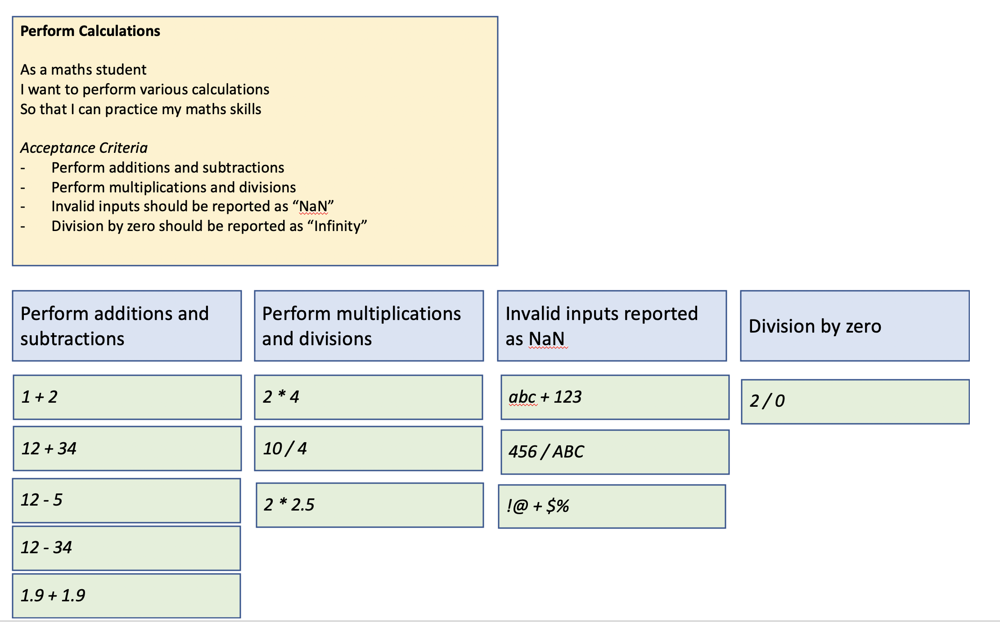
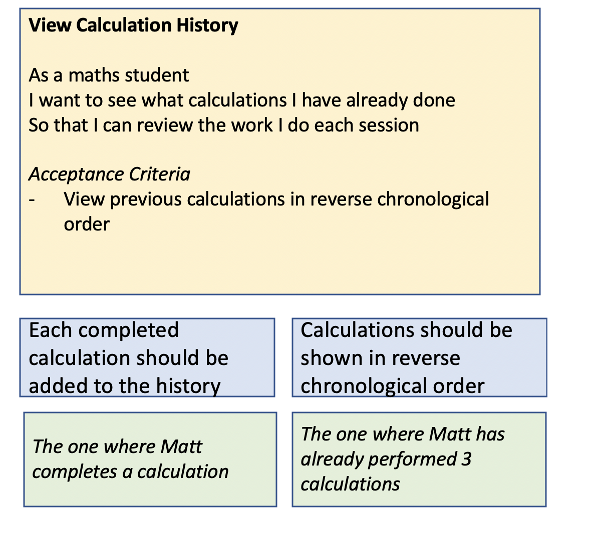

# Exercise 2 - FORMULATE

In this exercise, we will turn the examples in the Example Map we created into Gherkin scenarios.

A sample example map for the first user story is shown here:

The example map for the second user story is shown below:

